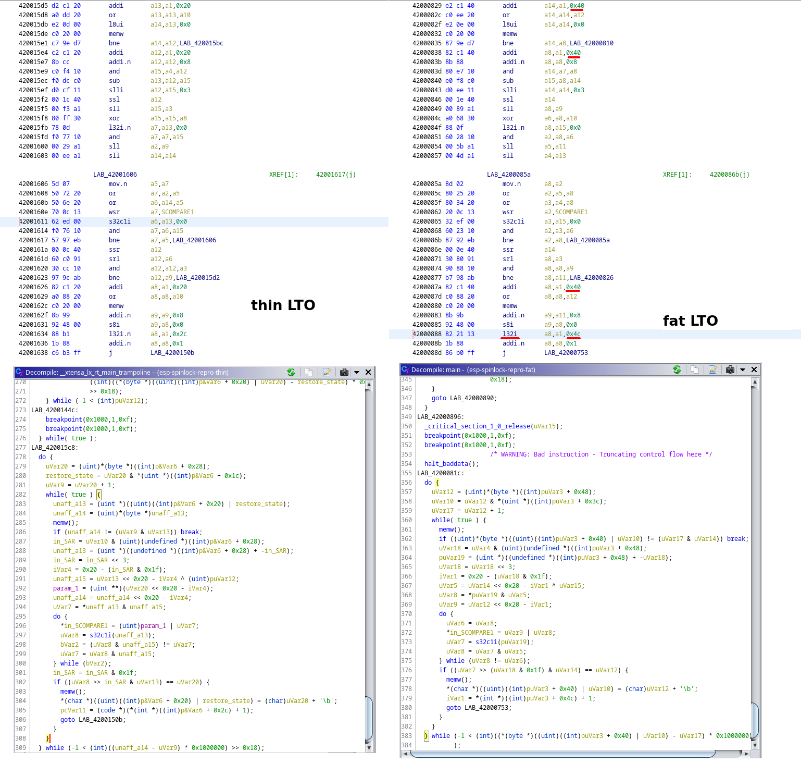

# esp-spinlock-repro
Running `cargo espflash --release --monitor` with fat LTO enabled seems to cause the timer driver to misbehave and 
lock the thread up after working as intended beforehand, exactly 256 times.

This looks like a bug with `CAS` semantics when compiling with fat LTO.

Optimization level doesn't seem to affect the result.

The serial output should be the following and no more, when compiling with LTO="fat". Other settings result in the 
timer continuing to work:
```
counter at 0
counter at 1
counter at 2
counter at 3

...

counter at 253
counter at 254
counter at 255
counter at 256
 
 
!! A panic occured in 'src/main.rs', at line 7, column 1
 
PanicInfo {
    payload: Any { .. },
    message: Some(
        called `Option::unwrap()` on a `None` value,
    ),
    location: Location {
        file: "src/main.rs",
        line: 7,
        col: 1,
    },
    can_unwind: true,
}
 
Backtrace:
 
0x42000a1a
0x42000a1a - esp_spinlock_repro::__xtensa_lx_rt_main
    at ??:??
0x420035c4
0x420035c4 - Reset
    at ~/.cargo/registry/src/github.com-1ecc6299db9ec823/xtensa-lx-rt-0.13.0/src/lib.rs:77
0x403785aa
0x403785aa - ESP32Reset
    at ~/.cargo/registry/src/github.com-1ecc6299db9ec823/esp32s3-hal-0.3.0/src/lib.rs:233
0x40000000
0x40000000 - _external_heap_end
    at ??:??
0x403cdb78
0x403cdb78 - _text_heap_end
    at ??:??
0x403c996c
0x403c996c - _text_heap_end
    at ??:??
0x40045c04
0x40045c04 - rom_config_instruction_cache_mode
    at ??:??
0x40043ab9
0x40043ab9 - rom_config_instruction_cache_mode
    at ??:??
0x40034c48
0x40034c48 - rom_config_instruction_cache_mode
    at ??:??
0x40000000
0x40000000 - _external_heap_end
    at ??:??
```

Whereas running `cargo espflash --monitor` results in
```
counter at 0
counter at 1
counter at 2
counter at 3

...

counter at 253
counter at 254
counter at 255
counter at 256

...


counter at 10000
counter at 10001
counter at 10002
counter at 10003

...
```



This was reproduced on ESP32S3 w, using the `esp` rust toolchain, versions `1.64.0.0`, `1.65.0.0`, `1.65.0.1`.
